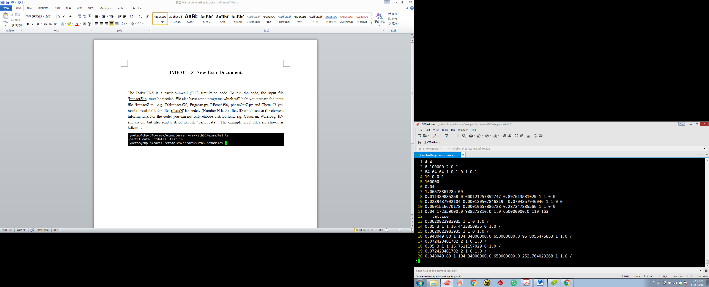
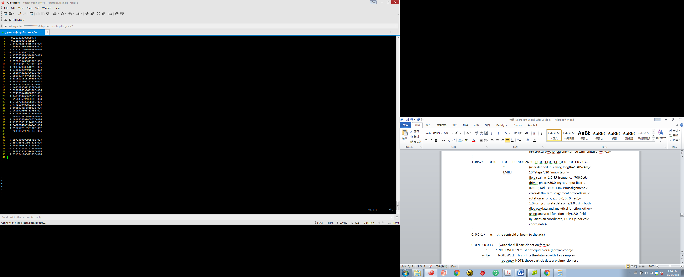
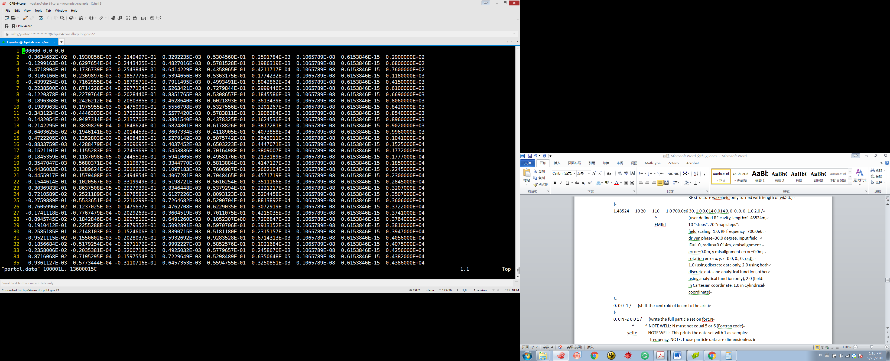
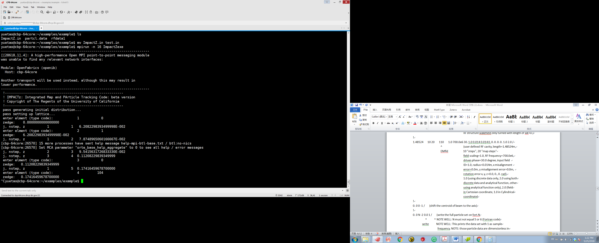
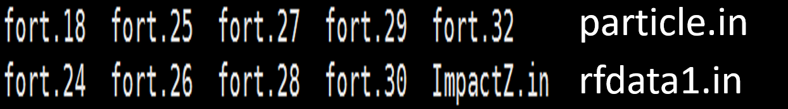

# IMPACT-Z User Document Version 2.7

Ji Qiang

Lawrence Berkeley Nation Laboratory

Copyright @The Regents of the University of California

> July 16, 2025

# Contents

[1. Introduction [1](#section)](#section)

[2. Programs to prepare input files
[1](#programs-to-prepare-input-files)](#programs-to-prepare-input-files)

[3. Input Files [1](#input-files)](#input-files)

[1.1. ImpactZ.in [2](#impactz.in)](#impactz.in)

[1.1.1. Beam Section [2](#beam-section)](#beam-section)

[1.1.2. Lattice Section [4](#lattice-section)](#lattice-section)

[1.2. rfdataN.in [9](#rfdatan.in)](#rfdatan.in)

[1.3. particle.in [10](#particle.in)](#particle.in)

[4. Run IMPACT-Z [10](#run-impact-z)](#run-impact-z)

[2.1. Run IMPACT-Z [10](#run-impact-z-1)](#run-impact-z-1)

[2.2. Console [11](#console)](#console)

[2.3. Stop IMPACT-Z [12](#stop-impact-z)](#stop-impact-z)

[5. Output Files [12](#output-files)](#output-files)

[5.1. File fort.18: reference particle information
[12](#file-fort.18-reference-particle-information)](#file-fort.18-reference-particle-information)

[5.2. File fort.24 (for X) fort.25 (for Y), fort.26 (for Z) : RMS size
information
[13](#file-fort.24-for-x-fort.25-for-y-fort.26-for-z-rms-size-information)](#file-fort.24-for-x-fort.25-for-y-fort.26-for-z-rms-size-information)

[5.3. File fort.27: maximum amplitude information
[13](#file-fort.27-maximum-amplitude-information)](#file-fort.27-maximum-amplitude-information)

[5.4. File fort.28: load balance and loss diagnostic
[13](#file-fort.28-load-balance-and-loss-diagnostic)](#file-fort.28-load-balance-and-loss-diagnostic)

[5.5. File fort.29: cubic root of 3rd moments of the beam distribution
[13](#file-fort.29-cubic-root-of-3rd-moments-of-the-beam-distribution)](#file-fort.29-cubic-root-of-3rd-moments-of-the-beam-distribution)

[5.6. File fort.30: square root, square root of 4th moments of the beam
distribution
[13](#file-fort.30-square-root-square-root-of-4th-moments-of-the-beam-distribution)](#file-fort.30-square-root-square-root-of-4th-moments-of-the-beam-distribution)

[5.7. File fort.32: number of particles for each charge state
[14](#file-fort.32-number-of-particles-for-each-charge-state)](#file-fort.32-number-of-particles-for-each-charge-state)

[5.8. Particle distribution coordinate unit
[14](#particle-distribution-coordinate-unit)](#particle-distribution-coordinate-unit)

## 

## Introduction

IMPACT-Z is a 3D parallel/serial Particle-In-Cell (PIC) code based on
multi-layer object-oriented design. The present version of IMPACT-Z can
treat intense beams propagating through drifts, magnetic quadrupoles,
magnetic solenoids, bending magnet, multipoles, and rf cavities, using
map integrator or nonlinear Lorentz integrator. (Warning: some elements
such as 3D EM field, can be used ONLY for Lorentz integrator.) It has a
novel treatment of rf cavities, in which the gap transfer maps are
computed during the simulations by reading in Superfish rf fields. The
goal is to avoid time-consuming (and unnecessary) fine-scale integration
of millions of particles through the highly z-dependent cavity fields.
Instead, fine-scale integration is used to compute the maps (which
involve a small number of terms), and the maps are applied to particles.
If you are familiar with magnetic optics, then you will recognize that
this is analogous to the technique used to simulate beam transport
through magnets with fringe fields.

The version of IMPACT-Z (v2.2) currently has a 3D space-charge model
that assumes a 3D open boundary conditions. The other boundary
conditions and more functions will be added later on in the new
versions. The error studies can include the field errors, misalignment
errors, and rotation errors.

## Programs to prepare input files

**Engscan.py**: does a single cavity phase scan.

**RFcoef.f90**: prepares Fourier expansion coefficients of RF or
solenoid field to be used in the simulation (with Lorentz nonlinear
integrator.)

**phaseOptZ.py**: sets up the RF driven phase of the cavities with the
user specified design phases.

Note:

1\) The current version of the code is for serial single processor
computer with Fortran90 compiler. To run the code on a parallel computer
with MPI, the user has to comment out the line "use mpistub" in
Contrl/Input.f90, DataStruct/Data.f90, DataStruct/Pgrid.f90,
DataStruct/PhysConst.f90, and Func/Timer.f90. The user also has to
remove the mpif.h file under the Appl, Control, DataStruct, and Func
directories. The user also has to modify the Makefile to remove the
mpistub.o inside the file and to use the appropriate parallel Fortran90
compiler such as mpif90.

2\) The subroutines in FFT.f90: realft, four1, and sinft, can be
replaced with functions from the Numerical Recipe or some equivalent 1D
FFT functions.

3\) To compile the code on Windows PC without "make" function, one needs
to move all \*.f90 files to one directory and use a compiler (g95 or
gfortran) to compile the code in a single line.

4\) There is a ImpactTv2.pdf document contains more detailed physics
description.

## Input Files

The main IMPACT input file is called [**ImpactZ.in**](#impactz.in). The
programs which will help you prepare the input file ‘**ImpactZ.in**’ are
list in section 2. If you need to read field, the file
‘**[rfdataN](#rfdata).in**’ is needed. (The number N is the filed ID
which is set in the element input information). For the initial
distribution, you can not only choose distributions in the code, e.g.
Gaussian, Waterbag, KV and so on, but also read distribution file
‘**particle.in**’.

WARNING: ***The / at the end of each line below is important***: the
read statement in IMPACT that reads all the beamline element info wants
to read in a lot of numbers. In a Fortran free-format read statement,
you can make it ignore the rest by using / at the end of the line.

So, if you neglect this, the code will crash. Also, any line starting
with ! will be treated as a comment line.

### ImpactZ.in 

The twelfth line of the ‘ImpactZ.in’ file starts with ‘!’ means a
comment line. And this line divides the file as two sections, [beam
section](#beam-section) and [lattice section](#lattice-section). The
code will not read this line.

### Beam Section

The beam section consists of 11 lines. Please see the example test.in as
follow:

[①](#l1) 4 4

[②](#l2) 6 100000 2 0 1

[③](#l3) 64 64 64 1 0.1 0.1 0.1

[④](#l4) 19 0 0 1

[⑤](#l5) 100000

[⑥](#l6) 0.04

[⑦](#l7) 1.0657886728e-09

[⑧](#l8) 0.011389835258 0.000121257352747 0.897613531029 1.0 1.0 0.0 0.0

[⑨](#l8) 0.0239487992104 0.000130507846319 -0.0704357946046 1.0 1.0 0.0
0.0

[⑩](#l8) 0.0501516670178 0.00010657886728 0.287347885566 1.0 1.0 0.0 0.0

[⑪](#l11) 0.04 172359000.0 938272310.0 1.0 650000000.0 110.163

The 1st line: processor
layout in y and z dimension, the product of these numbers must equal the
number of processors (4, 4) that you run on.

The 2nd line: “6” for
random seed of simulation, “100000” for macro particles used in
simulation, "2" for nonlinear Lorentz integrator, ("1" for linear map
integrator), “0” for no error study ("1" for error studies) and “1” for
standard output ("2" for 90%, 95%, 99% emittance, radius output,
otherwise no output).

The 3rd line: 64x64x64
space-charge grid, “1” for 3D open all mesh numbers have to a power of
2, i.e. 2^n; "2" for transverse open, longitudinal periodic(the 3rd mesh
number has to 2^n+1), "3" for transverse finite, longitudinal open round
pipe (in this case, the 2nd mesh number has to be 2^n+1), "4" for
transverse finite, longitudinal periodic round pipe (in this case, the
2nd and the 3rd mesh number has to be 2^n+1), "5" for transverse finite,
longitudinal open rectangular pipe (in this case, the 1st and the 2nd
mesh number have to be 2^n+1),"6" for transverse finite, longitudinal
periodic rectangular pipe (in this case, all mesh number have to be
2^n+1)) (Note: in the current version, only 3D open BC available), x
pipe width "0.1" m, y pipe width "0.1" m, period length "0.10" m.

The 4th line:
distribution “type 19”, Here is what the distributions mean: 1=rectangle
in 6D phase space (for single charge), 2=6D Gaussian (single charge),
3=6D Waterbag (single charge), 4=Semi-Gaussian \[uniform position,
Gaussian momentum,sc\], 5=KV transverse, uniform longitudinal (sc),
16=6D Waterbag for multiple charge state (mc), 17=6D Gaussian for
multiple charge state (mc), 19=Read coords/momenta from external file
"particle.in" in ImpactZ format. 199=Parallel read in macroparticles
from “fort.x+myid” files (x is an input positive integer from the
2nd number of the initial distribution parameter line, myid
is the processor ID. All files are in binary format with the \# of
particles nptlocal as the 1st line, the particle data file
pts(1:9,1:nptlocal) as the second line), 22=Read coords/momenta from
external file "particle.in" in Elegant format. 35=Read coords/momenta
from external file "particle.in" in ImpactT output format. \[this is
undergoing tests in Testing directory. More later.\]) "0" means no
restart ("1" means to restart from some point after stop), "0" means no
sub-cycle ("1" means sub-cycle). "1" for \# of charge states = 1.

The 5th line: particle list for each charge stateset 1000000.

The 6th line: current for
each charge state 0.04A.

The 7th line: q/m for
each charge state. Here, we normalized each charge by the mass of
reference particle so that the reference particle has 1 AMU mass, but
less charge. For example, for a proton, 1/ 938.23e6 = 1.0657886728e-09.

The 8th – 10th
line: Twiss parameters of initial distribution.

(Explanation of preceding 3 lines: They are

Alpha_x beta_x emit_x mismatchx mismatchpx offsetX offsetPx

Alpha_y beta_y emit_y mismatchy mismatchpy offsetY offsetPy

Alpha_z beta_z emit_z mismatchz mismatchE offsetPhase offsetEnergy

The distribution in each plane is a quadratic form. There is no coupling
among planes. Alpha\_, beta\_(in meters for x and y, and degree/MeV for
z) are Twiss parameters, emit\_ is normalized emittance (in m-rad for x
and y, and degree-MeV for z).

The 11th line: current
averaged over rf period (0.04A, I=Q\*freq), initial kinetic energy
(172.359MeV), particle mass (938.272MeV/c^2), charge (1), scaling
frequency (650MHz) and initial phase of the reference particle
(110.163).

### Lattice Section

In the lattice section, each line denotes one beam line element (can be
marker element) except the line starting with ! character. The line
starting with ! is a comment line. It will be skipped during the
simulation. The 1st number denotes the element length. The
2nd and 3rd numbers are used to set numerical
integration steps across the element and the number steps to calculate
transfer map between each step or substeps. The example lattice
structure is Drift + Quad + Drift + RF Cavity + Drift + Quad + Drift +
RF Cavity.

[①](#e0) 0.0620822983935 1 1 **0** 1.0 /

[②](#e1) 0.05 3 1 **1** 16.4423850936 0 1.0 0. 0. 0. 0. 0. /

[③](#e0) 0.0620822983935 1 1 **0** 1.0 /

[④](#e104) 0.948049 80 1 **104** 34000000.0 650000000.0 96.8056476853 1
1.0 /

[⑤](#e0) 0.072423401702 2 1 **0** 1.0 /

[⑥](#e1) 0.05 3 1 **1** 15.7611197029 0 1.0 /

[⑦](#e0) 0.072423401702 2 1 **0** 1.0 /

[⑧](#e104) 0.948049 80 1 **104** 34000000.0 650000000.0 252.764023368 1
1.0 /

The 4th number of each line denote the element type.

**“0”** for drift, (example element
①) length=0.0620822983935m, 1 "step" where each step through the
beamline element consists of a half-step +a space-charge kick + a
half-step. Each half-step involves computing a map for that
half-element, computed by numerical integration with 1 "map step", pipe
radius is 1 m.

**“1”** for quadrupole, (example element ②), length=0.05m, 3 "steps," 1
"map steps", gradient=16.4423850936 Tesla/m, input gradient file ID (if
\>0, read in fringe field profile; if\<-10 use linear transfer map of an
undulator, if \>-10 but \<0, use k-value (i.e. Gradient/Brho) linear
transfer map; if=0 linear transfer map using gradient), radius = 1.0, x
misalignment error=0.0m, y misalignment error=0.0m, rotation error x, y,
z = 0.0, 0.0, 0.0 rad.

**“2”** for 3D constant focusing, (*e.g.* 0.30 4 20 2 9.8696 9.8696
9.8696 0.014 / )

length=0.3m, 4 "steps", " 20 "map steps",kx0^2=9.8696, ky0^2=9.8696,
kz0^2=9.8696, radius=0.014m. Note, it does not work for Lorentz
integrator option.)

**“3”** for solenoid, (*e.g.* 0.30 4 20 3 5.67 0. 0.014 0. 0. 0. 0. 0.
/)

length=0.3m, 4 "steps," 20 "map steps", Bz0=5.67 Tesla, input field file
ID 0., radius=0.014m, x misalignment error=0.0m, y misalignment
error=0.0m, rotation error x, y, z=0.0, 0., 0. rad.

Note: For the Lorentz integrator, the length includes two linear fringe
regions and a flat top region. Here, the length of the fringe region is
defined by the 2\*radius. The total length = effective length +
2\*radius.)

**“4”** for dipole, (*e.g.* 1.48524 10 20 4 0.1 0.0 150. 0.014 0.0 0.0
0.0 0.0 0.0 0.0 0.0 0.0 0.0 0.0 / )

length=1.48524m, 10 "steps", 20 "map steps", bending angle 0.1rad,
k1=0.0, input switch 150., if \> 200, include 1D CSR, half gap = 0.014m,
0.0 = entr. pole face angle(rad), 0.0 = exit pole face angle, 0.0 =
curvature of entr. face, 0.0 = curv. of exit face, 0.0 = integrated
fringe field, 0.0 = x misalignment error, 0.0 = y misalignment error,
0.0 = x rot. error, 0.0 = y rot. error, 0.0 = z rot error.

**“5”** for thick lens multipole, (*e.g.* 0.5 10 20 5 2.0 10.0 0.0 0.02
0.0 0.0 0.0 0.0 0.0 / ) (work for Lorentz integrator only).

length=0.5m, 10 "steps", 20 "map steps", 2.0 is id for sextupole
(octupole (3), decapole (4)), 10.0 T/m^2 field strength, 0.0 no read-in
fringe field, 0.02 aperture size, 0.0 = x misalignment error, 0.0 = y
misalignment error, 0.0 = x rot. error, 0.0 = y rot. error, 0.0 = z rot
error.

**“6”** for wiggler/undulator, (*e.g.* 0.5 10 20 6 1.0 10.0 0.0 0.02 0.0
0.05 0.0 0.0 0.0 0.0 0.0 / ) (work for Lorentz integrator only).

length=0.5m, 10 "steps", 20 "map steps", 1.0 is id for planar undulator
(helical (2),), 10.0 T maximum field on axis, 0.0 no read-in fringe
field, 0.02 aperture size, 0.0 = kx, 0.05 m wiggler period length, 0.0 =
x misalignment error, 0.0 = y misalignment error, 0.0 = x rot. error,
0.0 = y rot. error, 0.0 = z rot error.

**“101”** for DTL, (*e.g.* 1.48524 10 20 101 1.0 700.0e6 30. 1.0 0.014
0.01 1.0 0.01 1.0 0.0 0.0 0.0 0.0 0.0 0.0 0.0 0.0 0.0 0.0 / )

length=1.48524m, 10 "steps", 20 "map steps", field scaling=1.0, RF
frequency=700.0e6, driven phase=30.0 degree, input field ID=1.0 (if
ID\<0, uses simple sinusoidal model, only works for the map integrator,
phase is design phase with 0 for maximum energy gain), radius=0.014m,
quad 1 length=0.01m, quad 1 gradient=1.0T/m, quad 2 length=0.01m, quad 2
gradient, x misalignment error=0.0m, y misalignment error=0.0m, rotation
error x, y, z=0.0, 0., 0. rad for quad, x displacement, y displacement,
rotation error x, y, z for RF field.

**“102”** means CCDTL, (*e.g.* 1.48524 10 20 102 1.0 700.0e6 30. 1.0
0.014 0. 0. 0. 0. 0. / )

length=1.48524m, 10 "steps", 20 "map steps", field scaling=1.0, RF
frequency=700.0e6, driven phase=30.0 degree, input field ID=1.0 (if
ID\<0, use simple sinusoidal model, only works for the map integrator,
phase is design phase with 0 for maximum energy gain), radius=0.014m, x
misalignment error=0.0m, y misalignment error=0.0m, rotation error x, y,
z=0.0, 0., 0. Rad.

**“103”** for CCL, (**e.g.** 1.48524 10 20 103 1.0 700.0e6 30. 1.0 0.014
0. 0. 0. 0. 0. / )

length=1.48524m, 10 "steps", 20 "map steps", field scaling=1.0, RF
frequency=700.0e6, driven phase=30.0 degree, input field ID=1.0 (if
ID\<0, use simple sinusoidal model, only works for the map integrator,
phase is design phase with 0 for maximum energy gain), radius=0.014m, x
misalignment error=0.0m, y misalignment error=0.0m, rotation error x, y,
z=0.0, 0., 0. Rad.

*e.g.* 1.037743e+000 2 1 103 0.1090744783E+08 1.3e9 -0.1743982832E+02
-1.01 1.0 /

("-1.01" for simple sinusoidal RF cavity model.)

**“104”** for superconducting
cavity, (example element ④) , length=0.948049m, 80 "steps", 1 "map
steps", field scaling=34000000.0, RF frequency=650.0e6, driven
phase=96.8056476853 degree, input field ID=1.0 (if ID\<0, use simple
sinusoidal model, only works for the map integrator, phase is design
phase with 0 for maximum energy gain), radius=1.0 m, x misalignment
error=0.0m, y misalignment error=0.0m, rotation error x, y, z=0.0, 0.,
0. Rad.

**“105”** for solenoid with RF cavity, (*e.g.* 1.48524 10 20 105 1.0
700.0e6 30. 1.0 0.014 0. 0. 0. 0. 0. 1. 0. 0. 0. / ) (use Fourier
coefficients for Ez(z), not for map integrator).

length=1.48524m, 10 "steps", 20 "map steps", field scaling=1.0, RF
frequency=700.0e6, driven phase=30.0 degree, input field ID=1.0,
radius=0.014m, x misalignment error=0.0m, y misalignment error=0.0m,
rotation error x, y, z=0.0, 0., 0. rad, Bz0=1.0 Tesla, 0. "aperture size
for wakefield", 0. "gap size for wk", 0. "length for wk". RF structure
wakefield only turned with length of wk\>0.

**“106”** for traveling wave RF cavity, (*e.g.* 1.48524 10 20 106 1.0
700.0e6 30. 1.0 0.014 0. 0. 0. 0. 0. 0.5 0. 0. 0. / ) (use Fourier
coefficients for Ez(z), not for map integrator).

Traveling wave RF cavity, length=1.48524m, 10 "steps", 20 "map steps",
field scaling=1.0, RF frequency=700.0e6, driven phase=30.0 degree, input
field ID=1.0, radius=0.014m, x misalignment error=0.0m, y misalignment
error=0.0m, rotation error x, y, z=0.0, 0., 0. rad, (pi - beta \* d)
phase difference B and A, 0. "aperture size for wakefield", 0. "gap size
for wk", 0. "length for wk". RF structure wakefield only turned with
length of wk\>0.

**“110”** for user defined RF cavity. (*e.g.* 1.48524 10 20 110 1.0
700.0e6 30. 1.0 0.014 0.014 0. 0. 0. 0. 0. 1.0 2.0 / )

length=1.48524m, 10 "steps", 20 "map steps", field scaling=1.0, RF
frequency=700.0e6, driven phase=30.0 degree, input field ID=1.0,
Xradius=0.014m, Yradius=0.014m, x misalignment error=0.0m, y
misalignment error=0.0m, rotation error x, y, z=0.0, 0., 0. rad), 1.0
(using discrete data only, 2.0 using both discrete data and analytical
function, other using analytical function only), 2.0 (field in Cartesian
coordinate, 1.0 in Cylindrical coordinate). The format of 3D field on
Cartesian grid is:

read(14,\*,end=33)tmp1,tmp2,tmpint

XminRfg = tmp1

XmaxRfg = tmp2

NxIntvRfg = tmpint !number of grid cells in x dimension

read(14,\*,end=33)tmp1,tmp2,tmpint

YminRfg = tmp1

YmaxRfg = tmp2

NyIntvRfg = tmpint !number of grid cells in y dimension

read(14,\*,end=33)tmp1,tmp2,tmpint

ZminRfg = tmp1

ZmaxRfg = tmp2

NzIntvRfg = tmpint !number of grid cells in z dimension

…

allocate(Exgrid(NxIntvRfg+1,NyIntvRfg+1,NzIntvRfg+1))

allocate(Eygrid(NxIntvRfg+1,NyIntvRfg+1,NzIntvRfg+1))

allocate(Ezgrid(NxIntvRfg+1,NyIntvRfg+1,NzIntvRfg+1))

allocate(Bxgrid(NxIntvRfg+1,NyIntvRfg+1,NzIntvRfg+1))

allocate(Bygrid(NxIntvRfg+1,NyIntvRfg+1,NzIntvRfg+1))

allocate(Bzgrid(NxIntvRfg+1,NyIntvRfg+1,NzIntvRfg+1))

…

read(14,\*,end=77)tmp1,tmp2,tmp3,tmp4,tmp5,tmp6

n = n+1

k = (n-1)/((NxIntvRfg+1)\*(NyIntvRfg+1))+1

j = (n-1-(k-1)\*(NxIntvRfg+1)\*(NyIntvRfg+1))/(NxIntvRfg+1) + 1

i = n - (k-1)\*(NxIntvRfg+1)\*(NyIntvRfg+1) - (j-1)\*(NxIntvRfg+1)

Exgrid(i,j,k) = tmp1

Eygrid(i,j,k) = tmp2

Ezgrid(i,j,k) = tmp3

Bxgrid(i,j,k) = tmp4

Bygrid(i,j,k) = tmp5

Bzgrid(i,j,k) = tmp6

**“**-**1”** shift the centroid of beam to the axis. *e.g.* 0. 0 0 -1 /

**“-2”** write the particle distribution into fort.N. *e.g.* 0. 0 N -2
0.0 10 /

NOTE: N must not equal 5 or 6 (Fortran code), or 24, 25, 26, 27, 29, 30,
32. This prints the data set with 10 as sample frequency (i.e. every 10
particles outputs 1 particle). Those particle data are dimensionless in
IMPACT internal unit. The normalization constants are described in the
following **paritcle.in**. If sample frequency is negative, the output
would be in the ImpactT particle format (except that the longitudinal z
is not absolute position but delta z, and pz is gamma instead of gamma
beta z).

**“**-**3”** write the accumulated density along R, X, Y into file
Xprof.data, Yprof.data, RadDens.data . *e.g.* 0. 0 0 -3 0.014 0.02 0.02
0.02 0.02 0.02 0.02 /

radius=0.014m, xmax=0.02m,pxmax=0.02 mc,ymax=0.02m,pymax=0.02 mc,
zmax=0.02 rad,pzmax=0.02 mc^2, if no frame range is specified, the
program will use the maximum amplitude at given location as the frame.

**“**-**4”** write the density along R, X, Y into file Xprof2.data,
Yprof2.data, RadDens2.data.

*e.g.* 0. 0 0 -4 0.014 0.02 0.02 0.02 0.02 0.02 0.02 /

radius=0.014m, xmax=0.02m,pxmax=0.02 mc,ymax=0.02m,pymax=0.02 mc,
zmax=0.02 rad,pzmax=0.02 mc^2, if no frame range is specified, the
program will use the maximum amplitude at given location as the frame.

**“**-**5”** write the 2D projections of 6D distribution in XY.data,
XPx.data, XZ.data, YPy.data, YZ.data, ZPz.data. *e.g.* 0. 0 0 -5 0.014
0.02 0.02 0.02 0.02 0.02 0.02 /

radius=0.014m,xmax=0.02,pxmax=0.02mc,ymax=0.02,pymax=0.02mc,zmax=0.02rad,pzmax=0.02
mc^2, if no frame range is specified, the program will use the maximum
amplitude at given location as the frame.

**“**-**6”** write the 3D density into the file fort.8. *e.g.*0. 0 0 -6
0.014 0.02 0.02 0.02 0.02 2 0.02 /

radius=0.014m,xmax=0.02m,pxmax=0.02mc,ymax=0.02m,pymax=0.02mc,zmax=2degree,pzmax=0.02
mc^2, if no frame range is specified, the program will use the maximum
amplitude at given location as the frame.)

**“**-**7”** write the 6D phase space information and local computation
domain information into files fort.1000, fort.1001,
fort.1002,...fort.(1000+Nprocessor-1). *e.g.* 0. 0 1000 -7 /

This function is used for restart purpose.

**“**-**8”** write slice info. into file fort.202 using 101 slices.
*e.g.* 0.0 0 202 -8 101.0 0.1 1.0 0.2 2.0 /

The fort.202 contains: bunch length coordinate (m), \# of particles per
slice, current (A) per slice, X normalized emittance (m-rad) per slice,
Y normalized emittance (m-rad) per slice, dE/E, uncorrelated energy
spread (eV) per slice, \<x\> (m) of each slice, \<y\> (m) of each slice,
X mismatch factor, Y mismatch factor. Here, the Twiss parameters at that
location are alphaX = 0.1, betaX = 1.0 (m), alphaY=0.2, betaY = 2.0(m).
If those parameters are not provided, the mismatch factor should be
neglected.

**“**-**10”** scale/mismatch the particle 6D coordinates. *e.g.* 0. 0 0
-10 0.014 0.1 0.2 0.3 0.4 0.5 0.6 / radius=0.014m (not used), 0.1 =
xmis, 0.2 = pxmis, 0.3 = ymis, 0.4 = pymis, 0.5 = tmis, 0.6 = ptmis.

**“**-**12”** apply instant linear transfer matrix kick from input file
fort.10. *e.g.* 0. 0 10 -12 0.014 / radius=0.014m (not used), 10 is for
the filename fort.10. The transfer matrix is in (x, x’, y, y’, z, dp/p)
coordinates.

**“**-**13”** collimate the beam with transverse rectangular aperture
sizes. *e.g.*0. 0 0 -13 0.014 -0.02 0.02 -0.04 0.04 / radius=0.014m (not
used), xmin = -0.02m, xmax = 0.02m, ymin = -0.04m, ymax = 0.04m.

**“**-**14”** switch off/on space-charge effects *e.g.* 0. 0 1 -14 0.014
0.0 / radius=0.014m (not used), 0.0 = off, 1.0 = on.

**“**-**16”** rotate the beam with respect to the horizontal x axis..
*e.g.* 0. 0 0 -18 0.014 0.5 / radius=0.014m (not used), rotation angle =
0.5 rad. (counter-clockwise for beam, i.e. clockwise for reference
coordinates system)

**“**-**17”** rotate the beam with respect to the vertical y axis..
*e.g.* 0. 0 0 -18 0.014 0.5 / radius=0.014m (not used), rotation angle =
0.5 rad.

**“**-**18”** rotate the beam with respect to the longitudinal axis..
*e.g.*0. 0 0 -18 0.014 0.5 / radius=0.014m (not used), rotation angle =
0.5 rad.

**“**-**19”** shift the beam longitudinally to the bunch centroid so
that \<dt\>=\<dE\>=0.

**“**-**20”** increase the beam energy spread. *e.g.*0. 0 0 -18 0.014
1000.0 / radius=0.014m (not used), increased energy spread = 1000.0 eV.

**“**-**21”** shift the beam centroid in 6D phase space. *e.g.*0. 0 0
-21 0.014 0.02 0.02 0.02 0.02 0.02 0.02 / radius=0.014m (not used),
xshift=0.02m,pxshift=0.02rad,yshift=0.02m,pyshift=0.02rad,
zshift=0.02deg,pzshift=0.02MeV.

**“**-**25”** switch the integrator type using the “bmpstp” the
3rd number of line. hift the beam centroid in 6D phase space.
*e.g.*0. 0 1 -25 0.01 / radius=0.01m (not used), use linear map
integrator, 0. 0 2 -25 0.01 / use the nonlinear Lorentz integrator for
complicated external fields where transfer maps are not available.

**“**-**40”** kick the beam longitudinally by the rf nonlinearity (the
linear part has been included in the map integrator and substracted.)
drange(3) - vmax (V), drange(4) - phi0 (degree), drange(5) - harm number
of rf. *e.g.*0. 0 0 -40 0.014 1.e6 -60.0 1 / radius=0.014m (not used),
maximum voltage = 1.0e6 eV, -60 degrees, and harmonic number (with
respect to reference frequency) = 1.

**“**-**41”** read-in RF cavity structure wakefield from rfdata41.in.
*e.g.* 0.0 0 1 -41 1.0 41 1.0 /

Or 0.0 0 1 -41 1.0 41 -1.0 / “1.0” not used, “41” is the file ID, “1.0”
turn on or "-1.0" turn off RF wakefield (if \<10 no transverse wakefield
effects included). In wakefield data file rfdata41, there are 4 columns
corresponding to longitudinal bunch length (m), longitudinal wake
function, x, and y wake functions.

**“**-**44”** apply thin lens RF deflection. *e.g.* 0.0 0 1 -44 2.0 1 /

2.0 strength, 1 switch for horizontal (\>=0) or vertical deflection
(\<0)

**“**-**52”** add energy modulation (emulate laser heater). *e.g.* 0.0 0
10 -52 0.0895d-03 1030.0d-9 7000.0 / uncorrelated energy spread by
"7000.0" eV using laser wavelength 1030d-9 m and the matched beam size
"0.0895d-3" m)

**“**-**55”** kick the beam using thin lens multipole. *e.g.* 0.0 0 10
-55 1.0 0.0 1.0 2.0 3.0 4.0 5.0 / “1.0” not used, 0.0 – dipole (k0), 1.0
– quad. (k1), 2.0 – sext. (k2), 3.0 – oct. (k3), 4.0 – dec. (k4), 5.0 –
dodec. (k5).

**“**-**99”** halt execution at this point in the input file. *e.g.* 0 1
1 -99 /

This is useful if you have a big file want to run part-way through it
without deleting a lot of lines.

1.  

    1.  

### rfdataN.in

Using RFcoef.f90 to prepare Fourier expansion coefficients of RF cavity
or solenoid.

### particle.in

Do not forget the first line total particle number.

## Run IMPACT-Z

1.  

2.  

### Run IMPACT-Z

mpirun –n 16 ImpactZexe (processors same with set in ImpactZ.in)

### Console

When the code is running, the console shows [the order of
elements](#orderelement), [elements type](#elementType), [position
Z](#z), [element steps](#elestep) and [total steps](#totalstep).

The order of the element:

Element type:

Position Z:

Element steps:

Total steps:

### Stop IMPACT-Z

Ctrl + C

## Output Files

There are some output files,
[fort.18](#file-fort.18-reference-particle-information),
[fort.24](#file-fort.24-for-x-fort.25-for-y-fort.26-for-z-rms-size-information),
[fort.25](#file-fort.24-for-x-fort.25-for-y-fort.26-for-z-rms-size-information),
[fort.26](#file-fort.24-for-x-fort.25-for-y-fort.26-for-z-rms-size-information),
[fort.27](#file-fort.27-maximum-amplitude-information),
[fort.28](#file-fort.28-load-balance-and-loss-diagnostic),
[fort.29](#file-fort.29-cubic-root-of-3rd-moments-of-the-beam-distribution),
[fort.30](#file-fort.30-square-root-square-root-of-4th-moments-of-the-beam-distribution)
and [fort.32](#file-fort.32-number-of-particles-for-each-charge-state).

### File fort.18: reference particle information

1st col: distance (m)

2nd col: absolute phase (radian)

3rd col: gamma

4th col: kinetic energy (MeV)

5th col: beta

6th col: Rmax (m) R is measured from the axis of pipe

### File fort.24 (for X) fort.25 (for Y), fort.26 (for Z) : RMS size information

1st col: z distance (m)

2nd col: centroid location (m)

3rd col: RMS size (m) (degree for fort.26)

4th col: Centroid momentum (rad for fort.24 and fort.25, MeV for
fort.26)

5th col: RMS momentum (rad for fort.24 and fort.25, MeV for fort.26)

6th col: Twiss parameter, alpha

7th col: normalized RMS emittance (m-rad for transverse and degree-MeV
for fort.26)

### File fort.27: maximum amplitude information

1st col: z distance (m)

2nd col: Max. X (m)

3rd col: Max. Px (rad)

4th col: Max. Y (m)

5th col: Max. Py (rad)

6th col: Max. Phase (degree)

7th col: Max. Energy deviation (MeV)

### File fort.28: load balance and loss diagnostic

1st col: z distance (m)

2nd col: min \# of particles on a PE

3rd col: max \# of particles on a PE

4th col: total \# of particles in the bunch

### File fort.29: cubic root of 3rd moments of the beam distribution

1st col: z distance (m)

2nd col: X (m)

3rd col: Px (rad)

4th col: Y (m)

5th col: Py (rad)

6th col: phase (degree)

7th col: Energy deviation (MeV)

### File fort.30: square root, square root of 4th moments of the beam distribution

1st col: z distance (m)

2nd col: X (m)

3rd col: Px (rad)

4th col: Y (m)

5th col: Py (rad)

6th col: phase (degree)

7th col: Energy deviation (MeV)

### File fort.32: number of particles for each charge state

1st col: z distance (m)

2nd col: number of particles for each charge state

### Particle distribution coordinate unit

if you use the "-2" type code (described in the explanation of test.in)
to print the data at various locations, the resulting data will be in
columns of the form x,px,y,py,t,pt, q/m, charge/per particle, id.

------------------------------------

**1st col:** x normalized by c/omega

**2nd col:** Px normalized by mc, here this column has to be divided by
gamma beta to convert to unit radian

**3rd col:** y normalized by c/omega

**4th col:** Py normalized by mc, here this column has to be divided by
gamma beta to convert to unit radian

**5th col:** phase (radian)

**6th col:** kinetic energy deviation (E0 -E) normalized by mc^2

**7th col:** q/m, for an electron, q = -1, m = 0.511001e6

**8th col:** charge per macro-particle (Coulomb per particle)

**9th col:** particle id
